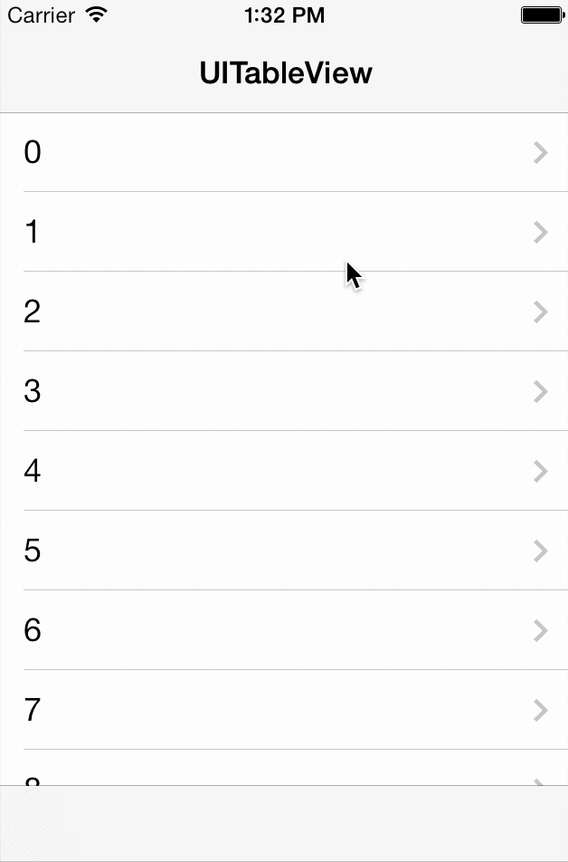

# NJKScrollFullSreen
NJKScrollFullSreen is Facebook App like scroll to full screen library.



This repository consists of full screen delegate and full screen UI behaivior module.

- `NJKScrollFullSreen`
 - Simple UIScrollViewDelegate wrapper. It called delegate methods when full screen wanted.
- `UIViewController+NJKFullScreenSupport`
 - Add full screen behaivior to UIViewController.

These modules are individual. You can implement your own customized full screen behavior without `UIViewController+NJKFullScreenSupport`.
`NJKScrollFullSreen` can apply not only UIScrollView but also UIWebView and UITableView.

# Requirements
- iOS 5.0 or later
- ARC

# Install
## CocoaPods

```
pod 'NJKScrollFullScreen'
```

# Usage
## 1. Instance `NJKScrollFullScreen`

Instance and set `UIScrollViewDelegate` on your view controller. If you set `scrollViewDelegate`, `NJKScrollFullScreen` suould perform as a proxy object.
```objc
- (void)viewDidLoad
{
    [super viewDidLoad];

    _scrollProxy = [[NJKScrollFullScreen alloc] initWithForwardTarget:self]; // UIScrollViewDelegate and UITableViewDelegate methods proxy to ViewController
    self.tableView.delegate = (id)_scrollProxy; // cast for surpress incompatible warnings
    _scrollProxy.delegate = self;
}
```

## 2. Implement delegate methods

```objc
- (void)scrollFullScreen:(NJKScrollFullScreen *)proxy scrollViewDidScrollUp:(CGFloat)deltaY
{
    [self moveNavigationBar:deltaY animated:YES];
}

- (void)scrollFullScreen:(NJKScrollFullScreen *)proxy scrollViewDidScrollDown:(CGFloat)deltaY
{
    [self moveNavigationBar:deltaY animated:YES];
}

- (void)scrollFullScreenScrollViewDidEndDraggingScrollUp:(NJKScrollFullScreen *)proxy
{
    [self hideNavigationBar:YES];
}

- (void)scrollFullScreenScrollViewDidEndDraggingScrollDown:(NJKScrollFullScreen *)proxy
{
    [self showNavigationBar:YES];
}
```

## 3. Implement full screen behavior

You can choose `UIViewController+NJKFullScreenSupport` or your own view management code.

Use `UIViewController+NJKFullScreenSupport.h`.

```objc
#import "UIViewController+NJKFullScreenSupport.h"
```

Or you can implement own full screen behavior like below.

```objc
- (void)showNavigationBar:(BOOL)animated
{
    CGFloat statusBarHeight = [UIApplication sharedApplication].statusBarFrame.size.height;
    [self setNavigationBarOriginY:statusBarHeight animated:animated];
}

- (void)hideNavigationBar:(BOOL)animated
{
    [self setNavigationBarOriginY:0 animated:animated];
}

- (void)moveNavigationBar:(CGFloat)deltaY animated:(BOOL)animated
{
    CGRect frame = self.navigationController.navigationBar.frame;
    CGFloat nextY = frame.origin.y + deltaY;
    [self setNavigationBarOriginY:nextY animated:animated];
}

- (void)setNavigationBarOriginY:(CGFloat)y animated:(BOOL)animated
{
    CGFloat statusBarHeight = [UIApplication sharedApplication].statusBarFrame.size.height;
    CGRect frame = self.navigationController.navigationBar.frame;
    CGFloat navigationBarHeight = frame.size.height;

    frame.origin.y = fmin(fmax(y, navigationBarHeight), statusBarHeight); // limit over moving

    [UIView animateWithDuration:animated ? 0.1 : 0 animations:^{
        self.navigationController.navigationBar.frame = frame;
    }];
}
```

# License
[Apache]: http://www.apache.org/licenses/LICENSE-2.0
[MIT]: http://www.opensource.org/licenses/mit-license.php
[GPL]: http://www.gnu.org/licenses/gpl.html
[BSD]: http://opensource.org/licenses/bsd-license.php
[MIT license][MIT].

